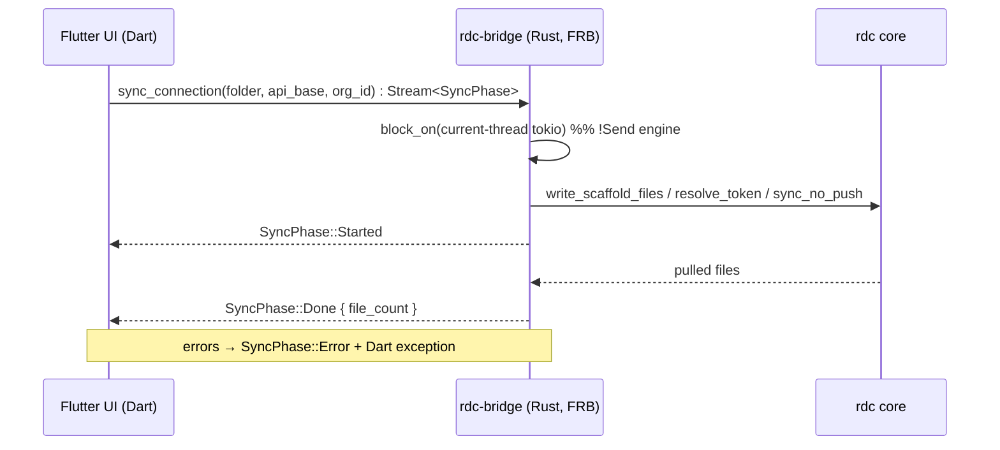

# Cross-platform desktop app — Flutter + flutter_rust_bridge

**Status:** design (brainstorming complete, awaiting review)
**Date:** 2026-07-24
**Supersedes:** the native macOS SwiftUI app (`macos/`) and its UniFFI bridge (`rdc-ffi/`)

## 1. Problem

The `rdc` CLI ships to Linux, macOS (x86_64 + aarch64), and Windows via a
GitHub Actions matrix (`.github/workflows/release.yaml`). The GUI ("Rossum
Local") does not follow: it is a **macOS-only** native SwiftUI app
(`macos/`) bridging to the Rust core through `rdc-ffi/`, a UniFFI crate that
emits only a macOS `.xcframework`. Its release workflow
(`.github/workflows/desktop-release.yml`) is stale — it still builds the
long-deleted Tauri `desktop/` directory with `cargo tauri build` and would
fail if triggered.

We want **one** desktop GUI that reaches the same three operating systems the
CLI already targets, replacing the macOS-only app.

## 2. Decisions (fixed during brainstorming)

- **One app for all three OSes**, replacing the SwiftUI app. Drop the Mac App
  Store / App-Sandbox / security-scoped-bookmarks path and the Liquid Glass
  look — none survive the move to a single cross-platform build.
- **Priority: UI quality, language-agnostic.** A non-Rust UI toolkit driving a
  Rust core over an FFI is acceptable.
- **Framework: Flutter + `flutter_rust_bridge` (FRB).** See §4 for the verified
  rationale versus the runners-up.
- **Strict feature parity** with today's app: the 7 operations, single
  environment `main`, pull-only sync. No new product features.
- **Backward compatibility** of the on-disk contract is mandatory (§7).
- **Update check:** a simple launch-time "a newer version is available"
  notification (manual download, no silent auto-install) (§9).
- **Layout / signing:** Flutter app at `desktop/`, bridge crate `rdc-bridge/`;
  macOS ships a notarized DMG via the existing Developer ID secrets;
  Windows/Linux signing deferred.

## 3. Goals / non-goals

**Goals**
- A single Flutter codebase producing installers for Linux, macOS, Windows.
- Byte-for-byte reuse of the `rdc` core for all file/credential/sync logic.
- Preserve CLI ↔ GUI interoperability on the same project folders.
- A working per-OS release pipeline that replaces the stale one.

**Non-goals (this iteration)**
- Push/deploy, multiple environments, diff/preview views.
- OS-native secret storage (Keychain / Credential Manager / libsecret) — strict
  parity keeps on-disk secrets.
- Mobile (iOS/Android) targets.
- Mac App Store distribution / sandboxing.

## 4. Verified facts and framework rationale

All framework facts below were checked against current sources (July 2026),
not memory.

- **Flutter desktop is GA on all three OSes.** Windows reached stable in
  Flutter 2.10; macOS and Linux in Flutter 3.0; current line is Flutter 3.38
  (Nov 2025). Flutter self-renders its UI (Impeller/Skia), so appearance is
  consistent across OSes rather than dependent on a system webview.
- **`flutter_rust_bridge` is current and desktop-capable.** Latest stable
  `2.12.0` (2026-03-29). The docs list Windows/Linux/macOS support, demonstrate
  Rust→Dart progress via `StreamSink<T>`, and auto-map Rust `Result` to Dart
  exceptions.
- **Build integration is automatic via Cargokit.** FRB uses Cargokit to compile
  the Rust crate during `flutter build`; an existing Cargo workspace member can
  be bound with `--rust-crate-dir`. No manual native-lib build step.
- **`rdc` is already a library** (`[lib] name = "rdc"`, `pub fn version()`
  documented "Exposed for embedders"), so the bridge crate depends on it via a
  path dependency exactly as `rdc-ffi` does today.

**Why Flutter over the runners-up**
- **Compose Multiplatform (Kotlin)** would *reuse the existing `rdc-ffi` UniFFI
  crate* via Kotlin/JVM bindings — the best code-reuse story — but bundles a
  trimmed JVM (larger installers) and carries a JNA-stability caveat. Reuse lost
  to the stated UI-quality priority.
- **Tauri v2** needs no FFI (Rust backend calls `rdc::` directly) and produces
  the smallest bundles, but renders through the system webview; on Linux that is
  WebKitGTK, which is documented as inconsistent across distributions —
  undercutting "best-looking *everywhere*." It is also the stack deliberately
  left behind. Flutter's self-rendering avoids the Linux-webview lottery.
- **Slint** (Rust-native; GPLv3-or-royalty-free/paid licensing, smaller widget
  ecosystem) and **Avalonia** (C#/.NET, MIT, Skia) were considered and set
  aside.

## 5. Architecture

```
desktop/                 Flutter app (Dart UI)  ──FRB generated glue──┐
rdc-bridge/  (workspace)  FRB-annotated Rust  ── path dep ──► rdc (lib)│
Cargo.toml   members = [".", "rdc-bridge"]                            ◄┘
```

Data flow for the one asynchronous operation (sync):



### 5.1 Workspace layout

- Delete `macos/` (SwiftUI app) and `rdc-ffi/` (UniFFI crate + `.xcframework`).
  Both existed only to serve the retired macOS app.
- Add `rdc-bridge/` as a workspace member (`members = [".", "rdc-bridge"]`)
  with a path dependency on `rdc`. One `Cargo.lock`; `cargo build` still builds
  the whole workspace.
- Add `desktop/`, the Flutter project, wired to the bridge via
  `flutter_rust_bridge_codegen generate --rust-crate-dir ../rdc-bridge`.
  Cargokit compiles `rdc-bridge` per-OS during `flutter build`.

### 5.2 `rdc-bridge` crate — a 1:1 port of today's surface

The crate mirrors the current `rdc-ffi` surface exactly and delegates every
call to `rdc::` with **no new credential or sync logic** (the discipline
stated at the top of `rdc-ffi/src/lib.rs`).

| Operation | Signature (conceptual) | Delegates to |
|---|---|---|
| `list_connections` | `(parent) -> Vec<ConnectionSummary>` | `discover::scan` |
| `add_connection` | `(parent, AddConnectionInput) -> ConnectionSummary` | `slug`, `secrets`, `discover::find` |
| `edit_credentials` | `(folder, EditCredentialsInput) -> ()` | `secrets` (wipe + rewrite) |
| `validate_existing_project` | `(path) -> ConnectionSummary` | `discover::inspect` |
| `sync_connection` | `(folder, api_base, org_id) -> Stream<SyncPhase>` | `cli::init`, `secrets::resolve_token`, `cli::sync::embed::sync_no_push` |
| `trash_connection` | `(folder) -> ()` | cross-platform trash (proposed dep; verify in plan) |
| `reveal_in_file_manager` | `(path) -> ()` | per-OS reveal command |
| `rdc_version` | `() -> Option<String>` | `rdc::version()` |

The table lists bridge *functions*, not the "7 user-facing operations":
`rdc_version` backs the About box, and `trash_connection` / `reveal_in_file_manager`
implement the Remove and Reveal actions. The seven user-facing operations are
list, add, edit-credentials, open-existing, sync, remove/detach, reveal.

Types port verbatim from `rdc-ffi`: `ConnectionSummary { id, name, api_base,
org_id, folder, auth_kind, last_sync_unix: Option<i64>, file_count }`,
`AuthKind { Token, Password }`, `AddConnectionInput`, `EditCredentialsInput`,
`SyncResult { file_count }`, and `SyncPhase { Started, Done{file_count},
Error{message} }`.

**Two mechanical changes vs. UniFFI** (behaviour identical):
1. Progress: the `#[uniffi::export(callback_interface)] SyncProgress` trait
   becomes an FRB `StreamSink<SyncPhase>`. The `!Send` sync engine still runs
   under a current-thread Tokio runtime via `block_on` on FRB's worker thread —
   that constraint (documented in `rdc-ffi/src/sync.rs`) is unchanged.
2. Errors: functions return `Result` (an error enum equivalent to today's
   `FfiError::Operation { message }`); FRB maps it to a Dart exception.

`connections.rs` / `discover.rs` / `sync.rs` and their unit tests port over
nearly verbatim — only the attribute macros differ. FRB discovers plain
`pub` structs/enums/functions from the annotated api module.

`trash_connection` and `reveal_in_file_manager` are the two ops that today live
in Swift (`FileActions.swift`). Implementing them in Rust keeps the Dart layer
platform-free. Reveal maps to `open -R` (macOS), `explorer /select,` (Windows),
and the FileManager1 D-Bus `ShowItems` with an `xdg-open <dir>` fallback
(Linux). The exact trash crate and reveal implementation are chosen and
verified in the implementation plan.

### 5.3 Flutter app (`desktop/`) — strict parity

- **Layout:** master–detail (sidebar connection list + detail pane), an
  empty-state "choose a parent folder" screen, matching today's
  `ContentView` / `SidebarView` / `DetailView` / `EmptyStateView`.
- **The 7 ops:** Add Connection (token or username/password form), Edit
  Credentials, Open Existing project, **Sync** (progress driven by the
  `SyncPhase` stream; Dock/taskbar affordance optional), Remove (managed →
  `trash_connection`) / Detach (external → forget the path only), Reveal.
- **Native dialogs:** folder/open pickers via the official `file_selector`
  package (desktop-supported). Filesystem side-effects (trash, reveal) go
  through the bridge (§5.2), so no per-OS Dart plugins are needed for them.
- **State:** connection list derived from disk (parent scan ∪ attached
  externals), deduped by folder, sorted by name — the same model as today's
  `ConnectionStore`. The parent folder path and any attached-external paths
  persist in app-private settings (`shared_preferences`) as plain paths (no
  sandbox → no bookmarks).
- Single env `main`, pull-only sync — unchanged.

## 6. Component boundaries

| Unit | Purpose | Interface | Depends on |
|---|---|---|---|
| `rdc` (lib) | all rdc logic | Rust API | — |
| `rdc-bridge` | expose 7 ops to Dart | FRB-generated Dart API | `rdc` |
| `desktop` bridge layer (Dart) | typed wrapper over generated glue | Dart repository interface | `rdc-bridge` glue |
| `desktop` state (Dart) | connection list + selection + sync state | `ChangeNotifier`/store | bridge layer, `shared_preferences` |
| `desktop` views (Dart) | UI | widgets | state |

The Dart bridge layer is an interface the state depends on, so tests can stub
it (FRB generates a mockable API surface) — mirroring how the SwiftUI app hid
the FFI behind `RdcBridging`.

## 7. Backward compatibility

- The shared on-disk contract — `rdc.toml`, `secrets/main.secrets.json`,
  `envs/main`, `.rdc/state` — is written and read **only** through `rdc::`
  helpers, exactly as today. Format is unchanged, so the CLI and GUI keep
  interoperating on the same folders byte-for-byte.
- App-private settings (parent path, attached externals) are new and clean.
  There is no migration from the SwiftUI app's `UserDefaults`/bookmarks: it is a
  different application. An existing macOS user re-picks their parent folder
  once; their **projects on disk are untouched**, so nothing is lost.

## 8. Build & release

Replace `desktop-release.yml` with a Flutter matrix mirroring `release.yaml`:

| Runner | Target | Package |
|---|---|---|
| `ubuntu-latest` | Linux x86_64 | AppImage and/or `.deb` (+ `.tar.gz`) |
| `macos-latest` | macOS universal (arm64 + x86_64) | notarized `.dmg` (Developer ID) |
| `windows-latest` | Windows x86_64 | NSIS or MSIX installer |

Each job installs Rust + Flutter, runs FRB codegen, then `flutter build`
(Cargokit compiles `rdc-bridge` for the host). macOS reuses the existing Apple
Developer ID secrets already configured in repo settings — "Developer ID
Application" is exactly the certificate for direct notarized distribution now
that the App Store path is dropped. Windows/Linux signing is deferred.

- Trigger stays the `desktop-v*` tag (separate from the CLI's `v*`).
- The Tauri Ed25519 updater feed (`latest.json`) is removed.
- `jpackage`/Tauri-specific steps are gone.

## 9. Update check

On launch, the app queries the GitHub Releases API for the latest `desktop-v*`
tag and, if it is newer than the running version (`rdc_version()`), shows a
non-blocking "a newer version is available" notice linking to the release page.
No silent download or auto-install.

**Known dependency / risk:** this repository is **private**, so unauthenticated
release-asset downloads currently return 404 — the same pre-existing blocker
already deferred for `rdc upgrade` and the Homebrew tap. The update check
therefore only fully resolves once releases are publicly reachable (repo goes
public) or the check authenticates with a token. The feature is built to be
correct, but is documented as gated on that deferred distribution fix; until
then it degrades gracefully (no-op / silent failure, never a hard error).

## 10. Testing

- **Rust:** port the `rdc-ffi` unit tests to `rdc-bridge` (they cover helper
  logic — scan/find/add/edit/validate — not UniFFI itself). Keep the
  `#[ignore]` live-sync test.
- **Dart:** widget tests drive the 7 flows against a stubbed bridge interface.
- **Manual:** a per-OS smoke checklist (like `macos/README.md`) run on Linux,
  macOS, and Windows.

## 11. Risks & open items

- **Update-check vs. private repo** (§9) — gated on the deferred public-download
  fix.
- **Bridge dependency choices** (trash / reveal crates) — verify platform
  coverage during implementation before committing to a crate.
- **Bundle size** ~20–40 MB per OS (Flutter engine) — acceptable, larger than
  the CLI, smaller than a JVM-bundled alternative.
- **CI cost/time** — three OS runners plus Rust + Flutter toolchains per job.
- The concurrent-worker convention for this repo applies: implementation
  proceeds in this isolated `desktop-flutter` worktree; no shared-history
  rewrites; the maintainer publishes.

## 12. Out of scope

Push/deploy, multi-env, diff view; OS-keychain secrets; App Store / sandbox /
bookmarks / Liquid Glass; iOS/Android.

## References

- flutter_rust_bridge on crates.io / docs.rs (2.12.0): https://crates.io/crates/flutter_rust_bridge , https://docs.rs/crate/flutter_rust_bridge/latest
- FRB docs (desktop support, streams, Result): https://cjycode.com/flutter_rust_bridge/
- FRB quickstart (Cargokit build integration, `--rust-crate-dir`): https://cjycode.com/flutter_rust_bridge/quickstart
- Flutter desktop GA (Windows 2.10): https://www.xda-developers.com/flutter-2-10-windows-apps/
- Compose Multiplatform native distribution (jpackage): https://kotlinlang.org/docs/multiplatform/compose-native-distribution.html
- UniFFI Kotlin/JVM via JNA: https://mozilla.github.io/uniffi-rs/latest/kotlin/gradle.html
- Tauri v2 webview per platform (Linux WebKitGTK): https://v2.tauri.app/reference/webview-versions/ , https://github.com/orgs/tauri-apps/discussions/8524
- Avalonia (MIT, Skia): https://avaloniaui.net/ ; Slint licensing: https://slint.dev/blog/making-slint-desktop-ready

## 13. Implementation status (as built, 2026-07-24)

Implemented on branch `desktop-flutter`. Toolchain: **Flutter 3.44.8** (Dart
3.12.2), **flutter_rust_bridge 2.12.0**, Rust 1.95, Xcode 26.6, CocoaPods 1.17.

**Deviations from the design above (all deliberate, verified):**
- The bridge crate lives at **`desktop/rust/`** (FRB's default location, wired
  via Cargokit) rather than a top-level `rdc-bridge/`, and its package is named
  **`rdc_bridge`** (cargo underscore form). It is its **own cargo workspace**
  (the parent workspace `exclude`s `desktop/`) so it does not inherit
  `panic = "abort"` — FRB needs unwinding to convert panics to Dart exceptions.
- Progress uses an FRB `StreamSink<SyncPhase>` exposed to Dart as
  `Stream<SyncPhase>`; the correct Rust import is
  `crate::frb_generated::StreamSink` (not `flutter_rust_bridge::StreamSink`).
- `SyncPhase` (a data-carrying enum) makes FRB generate a Dart **freezed** union,
  so `freezed`/`freezed_annotation`/`build_runner` were added as Dart deps.
- App-private settings use **`dart:io` JSON** (`~/.rossum_local/settings.json`),
  not `shared_preferences`, to avoid an extra native plugin/pod. The only Dart
  plugin is `file_selector` (native folder dialogs); trash/reveal are in Rust.
- Flutter package/dir is `desktop/` with bundle id **`ai.rossum.local`** and
  product name **"Rossum Local"** (set in `macos/Runner/Configs/AppInfo.xcconfig`).
- The retired `macos/` (SwiftUI) and `rdc-ffi/` (UniFFI) dirs were deleted; the
  root workspace is now `members = ["."]`.

**Verification (all green):**
- `cargo test` in `desktop/rust`: 4/4 (ported discover/credential logic).
- Integration test against the real native library (`flutter test
  integration_test -d macos`): 4/4 — `rdcVersion`, add→list→validate round-trip
  (writes real `rdc.toml` + `secrets/`), empty-token rejection, non-project
  rejection.
- `flutter analyze lib`: no issues.
- `flutter build macos --debug`: builds **"Rossum Local.app"** with
  `rdc_bridge.framework` embedded; the app launches and runs.
- Windows/Linux builds are wired but not exercised on this macOS host; CI covers
  them via the three-OS matrix in `.github/workflows/desktop-release.yml`.
